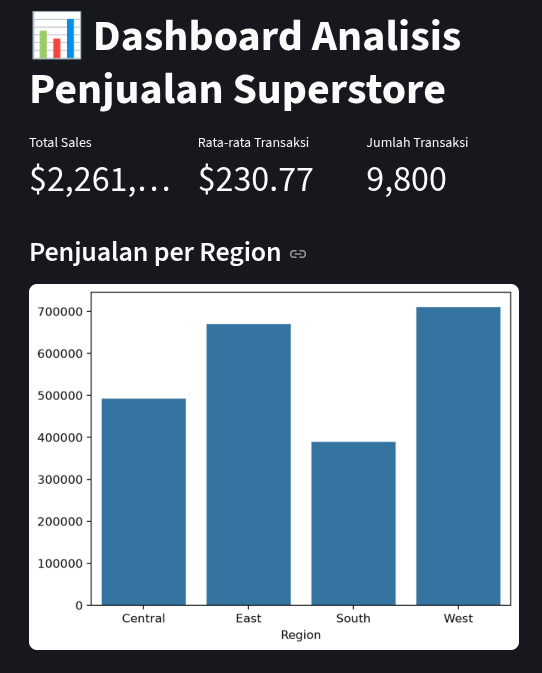
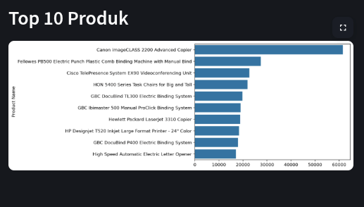

# 📊 Superstore Sales Analytics Dashboard

## 🚀 Deskripsi Proyek
Proyek ini adalah pipeline data lengkap dari CSV mentah hingga Dashboard Interaktif, mencakup:
- **Fase 1**: Data Cleaning (Pandas)
- **Fase 2**: Ekstraksi Data (SQLite, Window Functions)
- **Fase 3**: Visualisasi (Matplotlib, Seaborn) & Laporan PDF
- **Fase 4**: Dashboard Interaktif (Streamlit)

## 🔍 Insight Utama (BLUF)
> **Rekomendasi**: Fokus pemasaran ke region **West** (Sales $710K) dan evaluasi ulang region **South** ($389K).

| Region | Total Sales (USD) |
| :--- | :--- |
| **West** | 710,219.68 |
| **East** | 669,518.73 |
| **Central** | 492,646.91 |
| **South** | 389,151.46 |

## 🖥️ Tampilan Dashboard
| Grafik | Screenshot |
| :--- | :--- |
| **Sales per Region** |  |
| **Top 10 Produk** |  |

## 🛠️ Teknologi
- Python, Pandas, SQLite, Streamlit, Matplotlib, Seaborn

## ⚡ Cara Menjalankan
1. Clone repo: `git clone https://github.com/environtment-variable/MyPortofolio.git`
2. Buat venv: `python -m venv venv_data && source venv_data/bin/activate`
3. Install: `pip install pandas matplotlib seaborn streamlit`
4. Jalankan: `streamlit run dashboard.py`

## 📧 Kontak
- **Username**: environtment-variable
- **Proyek**: Portofolio Data Analyst
